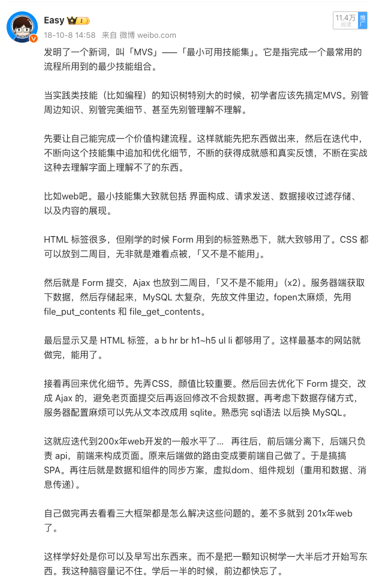
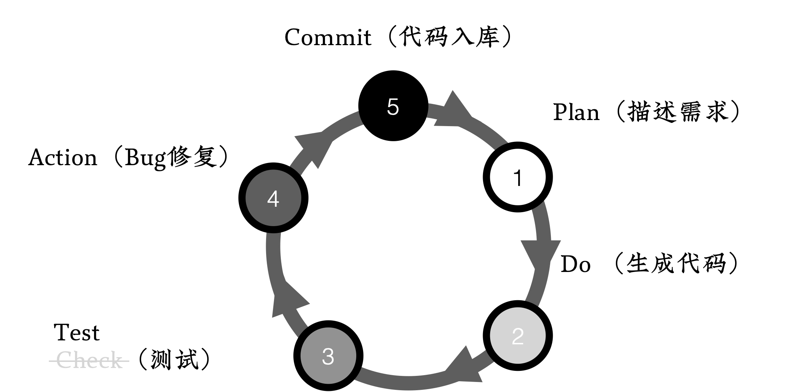
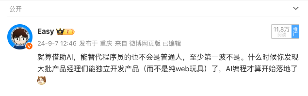
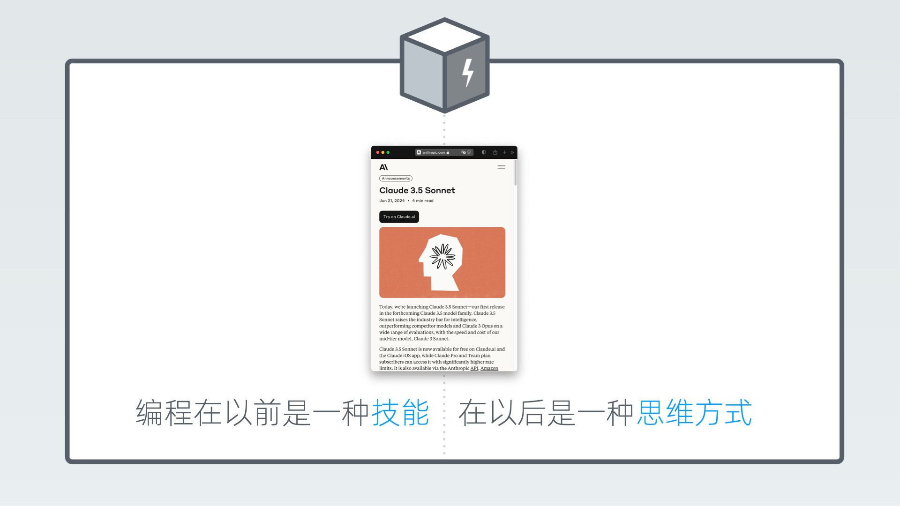
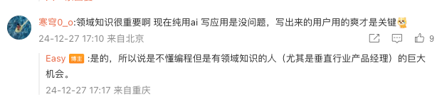
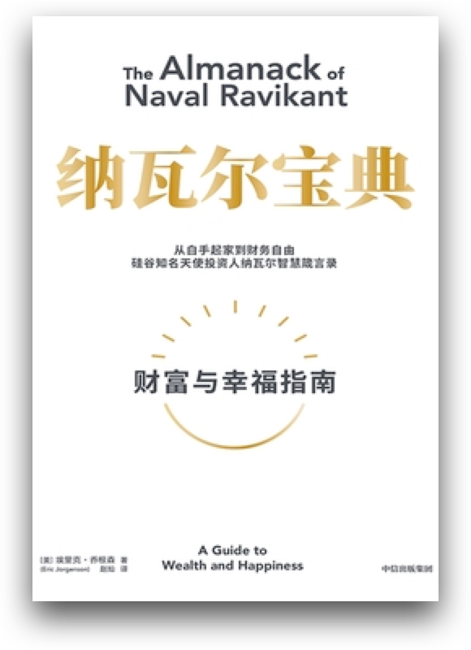
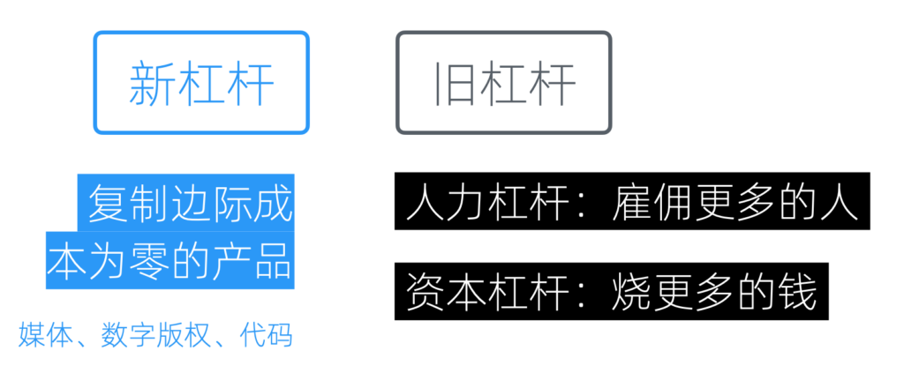

# 时代变了，大人

## 写给普通人的编程书

早在2018年，我就想做这么一件事：让零技术基础的普通人，通过学习编程，将自己的想法变成商业产品。然而，在执行的过程中，我遇到了很多问题。其中最大的困难有两个：

1. **概念爆炸**：软件发展到今天，已经相当的成熟，这对用户是好事，但对于学习者来说，需要了解的知识太多了。而且是在一时间扑面而来。我尝试提出了[最小可用技能集（MVS）的概念](https://weibo.com/1088413295/GCXOb60bm)，希望通过裁剪知识树，构建一个最简单的知识闭环让业务落地，但从最终的完课率来看，对于很多同学来讲，这些内容依然太多了。

2. **实践障碍**：这个问题其实是第一个问题的延续，不能很好地理解基础概念，就很难真正进入实践。就算照着课程照猫画虎，也并不理解背后的原理。只要场景有一点变化，就很难独立完成。学会的知识流于纸面，最终遗忘。

然而2024年下半年，我终于等到了这一天：**AI可以独立写出代码了**。为了和`LLM开发`、`LLM调用`等AI编程相关的概念区分，我称这种编程方式为`AI自编程`。

在经过采用AI自编程的方式开发过两个商业项目后，我可以确认，AI模型（目前仅限Claude3.5）已经足够强大，可以完美解决上述两个问题：

1. AI预置知识库加上搜索，可以实时为普通人补充用到的知识、讲解概念，并可以在多个深度上自如调整。
2. AI可以独立完成中低难度的编程任务，这让普通人可以用自然语言跳过技术和语法细节写出想要的应用。

然而，即使如此，AI也只是取代了以往的「语法学习」环节。软件开发是一门博大精深的学问，要通过自然语言写出**功能复杂、质量优秀**的应用，依然需要一些必须的专业知识。

这也是为什么我会写这本小书。

它从大模型的现状出发，结合我们过去半年的实践，再从软件工程中借用了一些工具，提出了一个专门为AI自编程优化的流程 —— **PDTAC循环**。使用它，普通人也可以写出功能复杂、质量优秀的应用，而不仅仅是那些「贪吃蛇」玩具。

对于普通人来讲，这些内容初听时略显专业，但实际操作却很简单，无需望而却步；而对于专业程序员来讲，这些内容可能是老生常谈，但总得有人把它们「贩卖」给普通人，我就先抛砖引玉了。

如果这本小书能帮助到你，我会很高兴。如果你的朋友也想学习AI自编程，请务必将这本小书推荐给TA。

## AI代替程序员？

从GPT问世以来，关于AI将取代程序员的传言就从未停止过。每一次AI技术的重大突破，都会引发新一轮「程序员即将失业」的讨论。然而，这些预言总是被证明是「狼来了」的故事。

在过去两年里，我已经习惯了如此，甚至会自动忽略相关信息。在我的认知里，这一天来得不会那么快，因为当时我正用着GitHub的Copilot，给我补全代码。

不过，在喧嚣的媒体之外，我持续留意着一些变化。

到10月，我陆续看到了一些产品经理和站长通过AI开发的产品，虽然复杂度不高，但出现的数量和速度惊人。于是我捡起了之前弃用的 Cursor，体验到了Claude 3.5 Sonnet 的强悍。

我知道，**这一天提前到了**。

## Claude3.5开启的新时代

很多人并没有意识到Claude3.5带来的重大变革；更多人把这个能力归于Cursor。但作为Cursor的老用户，我反而能更真切地感受到这种能力的来源。 

也许过些年回过头看，我们会发现Claude3.5模型的发布，标志着一个新的里程碑。往大了说可能是这样的：

> 编程在以前是一种技能，在以后是一种思维方式。

是的，编程能力不再专属于程序员。

想想一下，在哈利波特里边，麻瓜们不但不受限于血统，甚至连魔法都不需要学习，只需要喊一句「小爱同学」就可以释放魔法。

这就是现实。新人程序员们不用再纠结于计算机语言的语法了，他们可以跳过这个阶段，只需要像产品经理一样对着AI指指点点，应用就写出来了。

这极大地降低了编程的门槛。因为语法学习是如此痛苦，即使像我这样写了十年以上程序的人，在学习新语言的时候，依然会有这样的心得：

> Flutter 挺好学的，我两年都学了三遍了。

## 普通人编程时代的来临

当我在微博上发表对Claude3.5的感叹时，有位网友发表了一句评论：

> 领域知识很重要啊 现在纯用ai写应用是没问题，写出来的用户用的爽才是关键

如果从职业角度看，一个普通人要想通过AI自编程来获得「专业程序员」这个高薪职位，其实是很难的。原因很简单，就算大家都用自然语言编程，为什么老板不**选一个更有专业素养和经验的人**呢？程序员的失业通常不是被普通人替代，而是**被（借助AI而）效率更高的同事替代**。

但是从个体/副业/创业角度看，**这可能是程序员第一次处于劣势**。

纳瓦尔在《纳瓦尔宝典》中提出了一个概念，叫做「**新杠杆**」，并认为它是将个体的能力几何级数地放大，使其具备了和大型公司抗衡的能量的关键。

相对于「人力杠杆」和「资本杠杆」这种需要「别人许可」的传统杠杆来说，复制边际成本为零的「媒体」、「数字版权」和「代码」对每个人都触手可及，又可以实现产品的规模化。

- 「媒体」杠杆催生大量的自媒体和网红；
- 「数字版权」则让网课讲师和网文作者挣到了大钱；
- 唯有「代码」杠杆因为其高门槛，以前一直掌握在程序员们手里。

但现在，这个杠杆的门槛突然没了。是的，理论上讲，会打字就能写程序了 —— 区别只是复杂度和稳定性。

开发成本的降低，将导致相对小众的需求被满足，并由此催动一批超级个体的崛起。一如当年，网文满足了传统文学无法覆盖的小众市场。

在这个过程中，对于普通人而言，他们通常有着一份非技术的主业。当「放大器」对接到「主业」上，效果会立竿见影。如果他们不离职，还拥有「[副产品优势](https://ft07.com/discovery-of-by-product-advantages)」，可以将主业累积的工作流和方法论、行业知识和常识、备选方案和半成品、人脉关系和兴趣爱好通过软件和在线服务的方式规模化变现。

「杠杆」的本质是「放大器」，而零放大一亿倍还是零。程序员的劣势在于，他们太「专业」了，以至于他们真正熟悉的只有编码本身而不是代码承载的业务。相反，专注于业务、有想法但经常「只缺一个程序员」的产品经理们，在这一波浪潮里，可能是最大的受益方。因为AI的脾气是真的好，怎么改需求也不会被打。

当然，起跑线的差距只是统计意义上的，**个体的努力完全可以填平**。生活中处处都是需求，认真生活，深入群众，总是能发现好赛道的。

> 程序员永远不会失业，正如老兵不死，他们只是改做独立开发了。