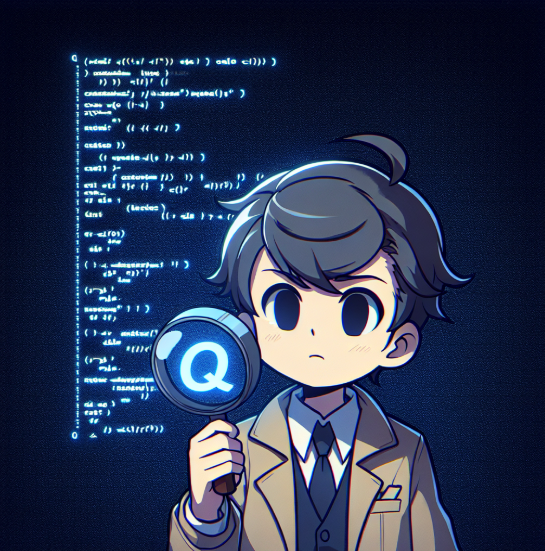
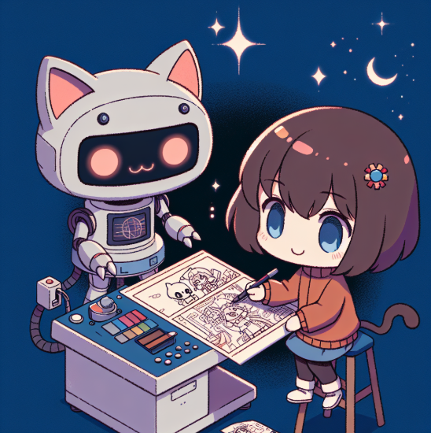

# 用以致学：先用后学，边用边学

在开始具体事务之前，我们先来聊聊AI自编程对学习和认知模式的颠覆。

## 学以致用过时了

「学以致用」是传统学习方法的金科玉律。它告诉我们：先把书读好，才能在实践中应用。这种方法确实很务实，通过实践来检验所学，避免纸上谈兵。但它的一个隐含假设值得思考：先学后用。

在现实中，许多人在学完之后会陷入「学而不用」的困境。学了半天，觉得自己已经掌握了，但没有实操的机会，知识很快被遗忘，甚至从未转化为实际能力。现代社会的快节奏和时间碎片化，更让这种「学完再用」的方式捉襟见肘。

相比之下，我更推崇一种激进的学习方式，那就是用以致学：先用后学、边用边学。初听之下，这种方法大有「好读书、不求甚解」的感觉。但实际上它大为不同，因为有「用」这个前提在。

### 用以致学的理念

「用以致学」是一种充满悬疑和实证性的学习方法，它让学习变成一个解密游戏。游戏一开始并不会告诉你所有规则，你需要在探索中发现问题，思考原因，找到解决方案。

先「用」，把业务架起来，运用起来。然后，问题就会像泉水一样涌出来。再带着疑问回过头来找原因，理解后提出新方案，并进行验证。当你解决这个问题，又会冒出新的问题。就这样，在不断解决问题的过程中，你的知识树正在悄然成型。这种方式特别高效，因为每一份知识都是应需求而学，都能立即得到应用和强化。

对于朝九晚五的上班族来说，这种学习方式简直是救命稻草。谁还能有整块时间坐下来啃书本？但用以致学不同，它可以完美利用碎片时间。今天解决一个小问题，明天优化一个小功能，知识就在这些零碎的实践中积累起来了。

### 遗忘的必然性

对于不以编程为职业的人来讲，「用以致学」显得更为重要。

一个残酷的现实是，即便你花半年时间学完了一门编程语言，如果没有实际应用，它很可能在数月后被遗忘殆尽。甚至，如果学习时间长一点，可能后边还没有学完，前边就已经忘了。

因此我们需要寻找一个使用场景，让我们一直持续不断地用下去。

不要忘了你学习的是编程知识。一个更残酷的现实是，当你学完以后，可能发现框架已经升级了N个大版本了。解决方案是什么？找到一个能持续带来收益的场景。这样，你就有动力持续学习，持续精进了。

> 毕竟，有钱能使磨推鬼。

## 被颠覆的学习与认知模式

「人只能挣到自己认知以内的钱」——这句话像一条金科玉律，曾经主导着我们对创业和商业的理解。但AI的出现，正在无声地改写这个规则。

想象一下，一位对编程一窍不通的创业者，现在可以通过与AI助手的对话，规划并实现一个功能完整的网络应用。这不是科幻电影里的场景，而是已经发生在当下的现实。过去需要耗费数月甚至数年去学习的专业技能，现在可以通过与AI的协作，在短短数周内实现从零到一的跨越。

这种变革远比表面看起来要深刻得多。它不仅仅是效率的提升，而是彻底改变了人类获取和运用知识的方式。过去，我们必须将知识内化为自己的能力才能实际运用它；现在，我们可以借助AI快速搭建起认知的脚手架，在「不懂」的状态下先把事情做起来，然后在实践中逐步深化理解。

举例而言，一个热爱漫画却不会画画的人，过去需要苦练绘画技能才能讲述自己的故事。而现在，他们可以使用AI来生成漫画故事，甚至动画。这种「先用后学」的模式，正在重塑我们对学习和创新的认知。

当然，在任何领域如果想要做到90分以上，还是需要把这些学习债务补上的，区别的只是顺序的不同。

但在某些领域，这一点点顺序的差异很重要。比如，创业领域。九成以上的创业项目不会成功，它们在找到「产品市场契合」之前就死掉了。《精益创业》告诉我们，对最小可用产品（MVP）来讲而言，软件质量并不是最重要的。重要的是弄清需求、了解市场和验证商业假设。

### AI时代的认知信用卡

现在，AI正像一张认知信用卡，让我们可以「先使用，后还债」，让很多不可能的事情变得可能。

比如说，一位在教育行业工作多年的老师，发现了一个改进在线教育的好想法。在过去，她可能会因为缺乏技术背景和启动资金而放弃这个想法。但现在，她可以通过AI自编程，仅仅花费百来块钱就快速开发出一个教育软件的原型。在这个过程中，**她不需要精通编程，而是专注于她最了解的教育场景和用户需求**。如果产品得到市场认可，她可以逐步学习必要的技术知识，或者招募技术团队来扩展产品。

这张信用卡让创新和创业变得更加大众化。不再是只有技术专家才能创造软件产品，不再是只有资深金融人士才能设计金融服务，不再是只有经验丰富的营销人才才能开展数字营销。任何对某个领域有深入理解的人，都可以借助AI的能力，将自己的洞察转化为实际的产品或服务。

这就是AI带来的颠覆：它不仅改变了我们获取和运用知识的方式，更重要的是，**它让创新和创业变得前所未有的平民化。在这个时代，每个人都有机会成为创新者和企业家**。

编程只是一个开始，新时代的大幕正在缓缓揭开。

