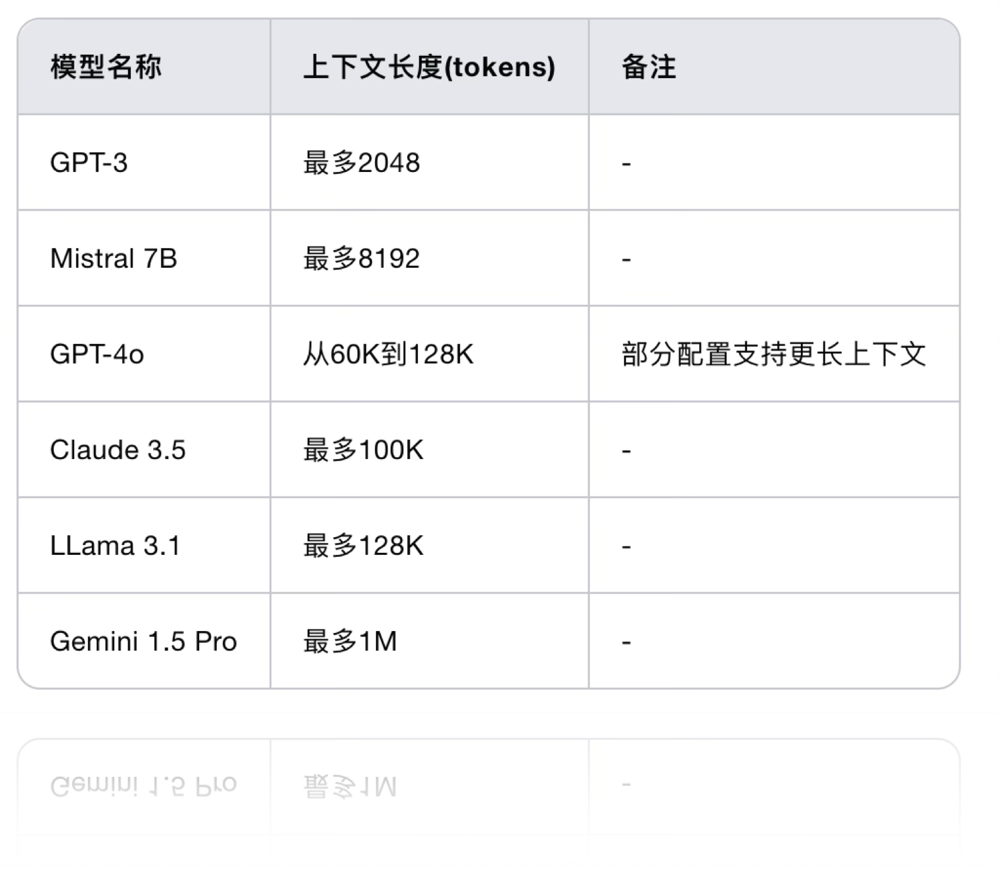
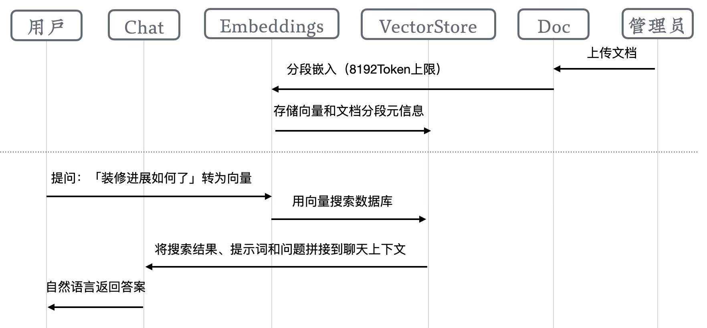
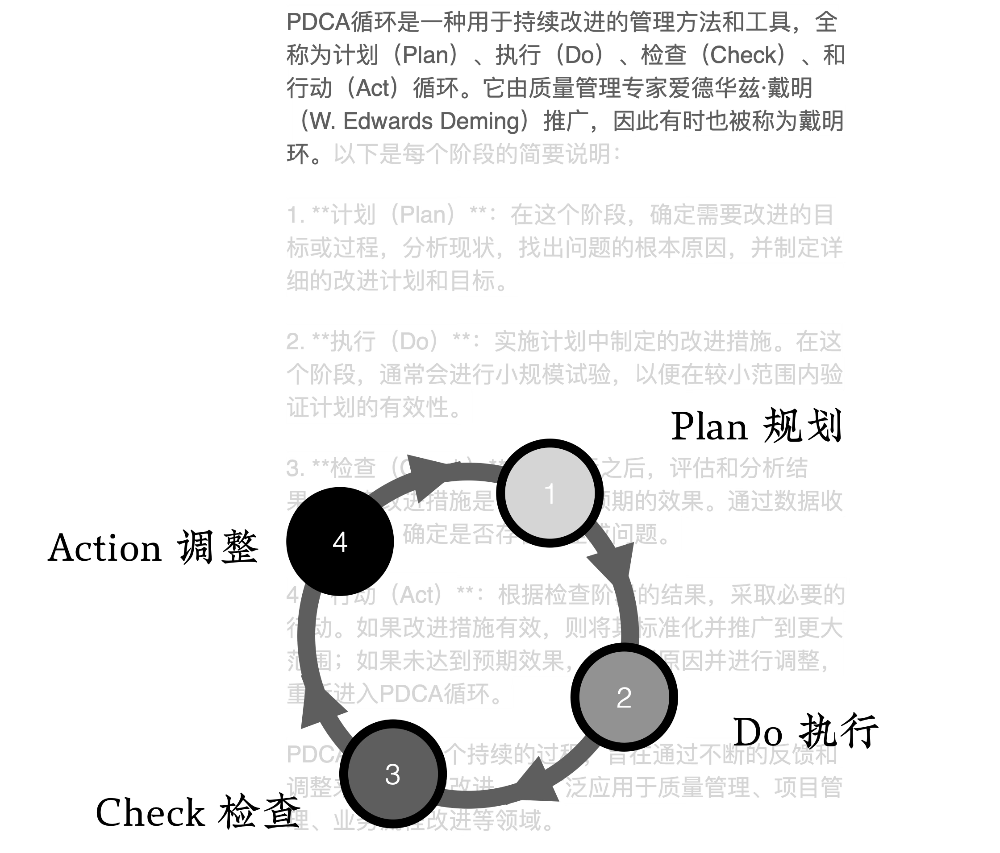

# 反馈螺旋：小步快跑

让我们从对时代变迁的感慨中抽离出来，开始专注于眼下的细节。看得见大局，更要做得好小事。

## 模型和业务的匹配

让我们先来直面一个现实问题：AI模型与业务需求之间存在的「能力差距」。现在的AI编程还处在蹒跚学步的阶段，就像一个聪明的新手程序员，它已经能漂亮地完成一些中低难度的编程任务，但在面对复杂的业务需求时，还会显得有些力不从心。那么，面对这样的局面，我们该如何应对？

有两条路摆在我们面前。

第一条路，就是选择等待。「等等党终会胜利」，我们可以安静地等待，直到AI模型成长得足够强大，完全胜任我们的业务需求。这个等待的时间可能不会太长，因为AI的进化速度令人惊叹。但这条路有个明显的问题：虽然你几乎不需要付出，也不用承担风险，稳稳地坐等胜利，但你可能会错过最珍贵的机会窗口。

第二条路，则是主动出击——改变我们的工作流程，让它与当前AI模型的能力相匹配。这就像是为AI量身定制一套「专属服务」。虽然这需要我们作出一些调整，但好处是显而易见的：我们可以立即开始使用AI的能力，提升业务竞争力，并且抢占市场先机。

更令人兴奋的是，这种改变带来了前所未有的机遇。

> 我知道这个话题有些重复了，但重要的事情值得说三遍。

想想看，以前那些小众需求，由于开发成本高昂，往往难觅程序员问津。毕竟，程序员们都有自己的本职工作要忙，如果找不到对特定项目感兴趣的开发者，这些小众需求就只能继续被搁置。

但现在，游戏规则已经改变。AI的加入大大降低了开发门槛，几乎人人都能开发出简单的应用。虽然这些应用在技术层面可能很基础，但它们对用户需求的理解和市场覆盖却可能异常精准。这就为创业带来了巨大的机会。

想想看，如果仅仅是写文章来满足人们的阅读需求，就能催生出大量自媒体和网红，那么当我们能以工具和服务的形式来满足那些小而急切的需求时，这个机会该有多大？

我常常这样形容当下的机遇：它堪比个人电脑普及时代的来临。

假设你能穿越回那个时代，明确地知道电脑即将改变世界，你会甘心看着机会从指缝中溜走吗？即便最后没能完全把握住机会，至少你努力过，不会留下遗憾，是吧？

而说到AI编程带来的机遇，我们甚至都不需要说「亡羊补牢」，因为「羊」还在这里，机会刚刚降临。我们有充足的时间去把握它，去拥抱这场变革。

这就是为什么我更建议大家调整工作流程，去适配当前的AI模型。未来已来，当然选择拥抱它。

## 如何适配大模型

理解了AI与业务之间的「能力差距」，并决定适配大模型以后，我们就来到了一个关键问题：如何让我们的工作方式与AI模型的能力完美匹配？

### 了解大模型

要回答这个问题，我们首先需要认识大语言模型。别被「认识」这个词吓到——我不是要带你深入模型的技术细节，钻研它的底层架构，甚至不需要你去学习如何调用API。虽然这些知识都很有价值，但如果你的目标是用AI自动编程，需要掌握的其实是另一些更实用的特性。

#### 预置知识库

几乎所有主流大模型都采用对话的方式提供服务。通过海量数据的训练，它们都内置了丰富的知识库，就像一个博学多识的朋友。不过这位朋友的「知识更新」总是会比现实世界慢上一两年——因为它的知识都是预先装载的，就像一本写好的百科全书。

不过，好消息是这一年来模型们都在努力追赶时代的脚步。特别是在用户界面上，它们开始学会了「现学现卖」——通过整合搜索功能，它们可以即时获取最新信息。这就像是这位朋友除了依靠自己的知识储备，还学会了随时查阅最新资料。虽然这些新知识还不是它的「固有记忆」，但至少让它能够与时俱进。

#### 推理能力

现在来说说一个让很多人惊讶的特性：大模型的推理能力。

有趣的是，很多程序员对此嗤之以鼻，认为大模型不过是一个靠概率生成文本的工具。这种看法并非完全错误，但未免过于武断。就像人类从蹒跚学步到能够跑步跳跃是一个渐进的过程，当模型的参数达到一定规模，经过大量代码训练，再配合思维链的引导，它展现出了令人惊叹的智能涌现现象。

这种涌现的能力，最直观的表现就是推理能力。你可以把它想象成一个善于归纳和演绎的学者，能够通过逻辑链条逐步推导出结论。就像几何学中从几个简单的公理可以推导出整个知识体系一样，有了知识库和推理能力，模型就能举一反三，从有限的信息中推导出更多洞见。

这就解释了为什么Claude 3.5能出色完成任务，而其他一些模型可能表现平平——关键就在于推理能力的差异。就像两个学生，知识储备相似，但分析问题的能力有高下之分。

#### 上下文窗口

接下来要说的是一个经常被误解的概念：上下文窗口。

很多人以为上下文就是提问和回答的内容总和，但实际情况要复杂得多。

有个有趣的事实是，大语言模型其实是「没有记忆」的。是的，你没听错。

当我们使用ChatGPT这样的产品时，看似它记住了我们的对话，实际上每一轮对话系统都会把完整的对话历史重新发送给模型。这就像是每次交谈，都会把之前说过的话重新告诉它一遍。不仅如此，上下文还可能包含网络搜索结果、上传的文档等内容。

上下文窗口可以有多大呢？

让我们看看它的发展历程：2023年GPT-3刚出道时，只能处理2048个token（相当于800个中文字）；到了现在，Claude 3.5已经能处理100K了；Google的Gemini 1.5 Pro 更是号称达到了惊人的1000K（也就是1000000个token）。

但这里有个有趣的现象：就像人类注意力会在阅读长文时逐渐分散一样，模型处理特长文本时的表现也会大打折扣。所以在实际应用中，短小精悍往往比冗长絮叨更有效。

### 适配策略

基于对这些特性的理解，我们就知道该如何调整工作流程了。

#### 一次只做一件事

最重要的原则是：一次只做一件事。

为什么？因为同时处理多个任务会让模型像一个多线程的大脑一样启动多个思维链。如果这些任务既有共同点又有差异，很容易造成「思维混乱」，就像人同时做多件事容易出错一样。

#### 让任务规模与上下文窗口相匹配

第二个重要原则是：让任务规模与上下文窗口相匹配。

比如我们使用 Claude3.5 模型，它的上下文窗口是100K，那就意味着我们需要把相关资料控制在这个范围内，并且还要预留返回内容占用的Token数。如果通过API形式调用模型，一旦超过这个值会直接报错。如果通过官方的网站和APP使用，通常软件会自动删减内容以防止出错。

考虑到模型处理特长文本时注意力会逐渐衰减，保持更短的长度可能会带来更好的效果。就像人类阅读长文一样，越往后注意力越容易分散。

##### 检索增强（RAG）

但现实总是充满挑战。在编程领域，我们经常会遇到这样的情况：一个项目动辄成百上千个文件，每个文件可能就有几十K的代码量。虽然100K或2000K的上下文对于日常对话来说已经很宽裕了，但面对庞大的代码库时，这个上线很快就会被触及。

这时候我们就需要引入检索增强（RAG）技术。它本质上是对资料的预处理。就像是我们在图书馆查阅资料——虽然我们无法同时阅读所有的书籍，但我们可以先从目录找到最相关的章节，然后只阅读这些章节。

检索增强技术的核心理念看起来只是增加了一个相关资料的搜索 —— 实际也是如此，但目前主流方案采用的是基于向量的语义搜索。传统的关键词搜索就像是在书中寻找特定的词语，如果作者用了不同的表达方式，即使意思相近也可能搜索不到。

而现代的检索增强技术采用了更智能的「向量化」方法。它会先将资料分成适当的片段，然后将这些文本片段转化为向量（可以理解为多维空间中的坐标点），同时也会将你的问题转化为向量。最后，系统会在这个多维空间中寻找与你的问题最接近的片段，就像在星空中寻找最临近的星星。

一些AI工具会将这个过程自动化。以Cursor为例，它会自动为项目目录下的文本文件建立索引。这个功能虽然可以在配置中关闭，但我强烈建议保持开启。当你选择了「Codebase」方式提出问题时，它会在整个项目范围内进行智能搜索，找出最相关的代码片段，将它们放入上下文中，从而帮助模型生成最准确的答案。

总结一下，为了让我们的工作流程更好地适配AI模型，我们需要遵循三个核心原则：

1. 一次只处理一个任务，避免思维混乱；
2. 将任务规模控制在上下文窗口范围内，确保模型能够充分理解；
3. 对于大型项目，善用检索增强，让AI能够精准定位并利用关键信息。

这就像是在与一位博学但注意力有限的助手合作——我们需要用恰当的方式提供信息，才能获得最佳的协作效果。

## 让业务适配大模型

即使在了解了以上原则，面对复杂的业务需求，我们依然会感到困惑：我们的业务是一个庞大而复杂的整体，如何让它适配AI模型的能力限制呢？这个问题的答案，藏在一个经典而强大的管理工具中——PDCA循环。

PDCA循环最初是由管理大师戴明提出的质量管理工具，它以其简洁而高效的特点，在全球范围内广受推崇。这个工具之所以被称为「循环」，是因为它像一个永不停歇的螺旋，推动项目不断向上攀升。每一圈螺旋都包含四个关键步骤：Plan（计划）、Do（执行）、Check（检查）和Action（行动）。

想象一下建造一座高楼的过程。如果我们试图一次性完成所有工作，这无疑是令人生畏的。但如果我们将整个工程分解成一层一层，每一层都经过严格的计划、执行、检查和改进，这座高楼就会稳步地拔地而起。PDCA循环正是这样的工作方法——它帮助我们将庞大的业务拆分成一个个可管理的小任务，每个任务都经历一个完整的循环，最终汇聚成项目的整体进展。

当我们将PDCA应用到AI编程领域时，这四个步骤展现出了新的生命力：

Plan（计划）阶段：
这是我们描述需求的关键时刻。就像建筑师需要绘制详细的设计图纸一样，我们需要清晰地定义每个小功能的具体要求。这个阶段的准确性直接影响后续AI生成代码的质量。

Do（执行）阶段：
这是AI模型大显身手的时刻。基于我们的需求描述，它会快速生成相应的代码。这就像是有一个能够迅速将图纸转化为实物的神奇工匠，只不过这个工匠是AI。

Check（检查）阶段：
这是验证环节，我们需要仔细检查AI生成的代码是否满足要求。对于程序员来讲，可以Review每一行代码；但对于普通人，只能从执行效果的角度去判断任务是否完成。

Action（行动）阶段：
如果在检查过程中发现问题，这个阶段就是进行修复和优化的时机。就像建筑工程中发现问题需要及时补救一样，我们需要修复代码中的bug，确保其完美运行。

然而，AI编程有其独特的特点，这让传统的PDCA循环需要一些调整。

- 首先，AI的能力是有边界的，就像一个才华横溢但专业领域有限的助手。
- 其次，AI的工作速度快得惊人，能在几秒钟内完成人类需要数小时才能完成的编码工作。
- 最后，也是最具挑战性的一点，AI的输出并非总是稳定的。

这种不稳定性表现得很特别：可能连续九次都完美执行任务，却在第十次莫名其妙地失常。这就像是一位天才艺术家，大部分时候都能创作出精品，但偶尔也会有灵感枯竭的时候。这是大语言模型固有的特性，很难完全避免。

**正是基于这些特点，我们对PDCA进行了创新性的改良，发展出了更适合AI编程场景的PDTAC循环**。这个优化版本保留了PDCA的精髓，同时增加了专门应对AI特性的新机制。关于PDTAC循环的详细内容我们会在后续章节深入探讨，你现在可以把它理解为一个经过强化的PDCA循环，专门为AI编程场景量身打造。

有了这个强化版的循环工具作为指导方法，我们就能够将庞大的业务需求优雅地拆解成一系列小型特性。每个特性都被精心控制在AI模型的上下文范围之内，确保我们能够专注地处理单一任务，从而获得最优的输出结果。

这种循环往复、稳步前进的方法，正是我们在AI自编程早期需要掌握的核心工作方式。它让我们能够以一种结构化、可控的方式驾驭AI的能力，将其转化为实实在在的生产力。

