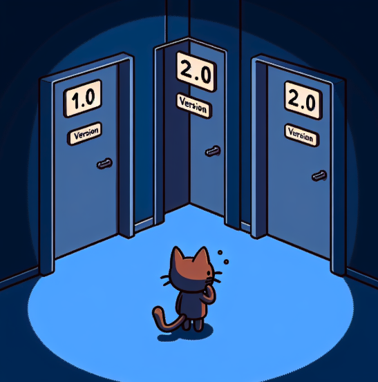
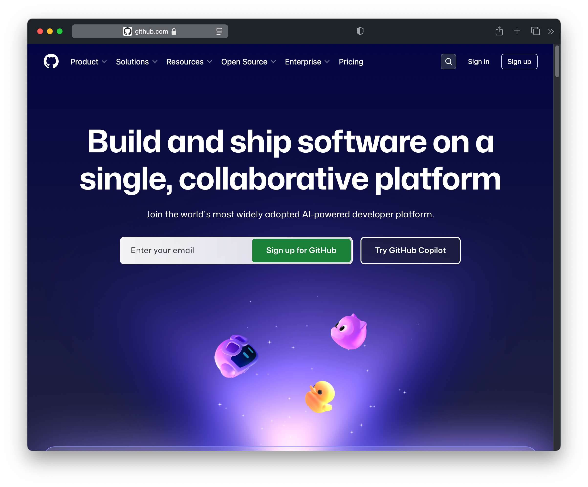
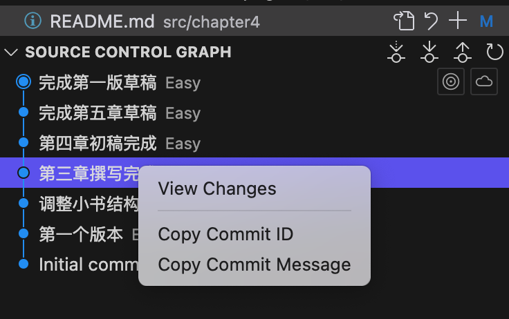
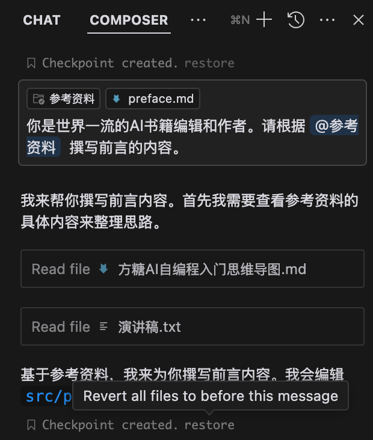

# 时间机器：版本管理

## 软件工程的重要性

在探讨版本管理这一章节之前，我觉得需要强调下软件工程的重要地位，因为后续两个重要工具都来自它。

作为计算机科学的重要分支学科，软件工程的一个突出贡献在于它让经验有限的程序员也能够开发出高质量的项目。这种能力令人瞩目，因为它实现了一个看似不可能的目标：让全球范围内的程序员能够进行超大规模的分布式协作。

软件工程作为一门学科，其重要性在过去可能被低估了。

尽管这门学科本身具有严谨的科学性，但其效果往往受到执行团队水平的制约。然而，在人工智能时代，这一状况正在发生改变。

### 软件工程与人工智能的契合

大模型与初级程序员有着诸多相似之处：它们都需要从基础开始，通过语言学习和知识积累来逐步提升能力，也都可能出现不稳定性和错误。

虽然通用人工智能的目标是构建世界模型，但从目前基于大语言模型的实现来看，它更像是在模拟人类：从牙牙学语到学会推理，同时也继承了人类的缺点：不确定性。

所以，为什么软件工程不能直接用于大模型和智能体呢？

相比人类团队，AI在执行标准化流程时表现出更强的可靠性和适应性。可以预见，在未来，随着人工智能深度参与开发过程，软件工程的原则和方法必将得到更广泛的应用。

需要说明的是，这种趋势并不意味着软件工程会立即转化为高薪就业机会。相反，它更多地体现为相关知识和实践在各个领域的广泛应用。

## 版本管理的必要性

在所有软件工程的解决方案中，版本管理是最基础也是最重要的工具之一。

当我们处理简短文档时，版本管理的重要性也许并不明显。但在编写长篇小说、学术论文或开发软件项目时，有效的版本管理就变得不可或缺。我们需要能够追踪修改历史，随时回溯到之前的版本。

虽然现代文字处理软件通常包含一些版本控制功能，但在处理程序代码或图形设计等复杂项目时，专业的版本管理工具就显得尤为重要。

### 版本管理的实现方式

#### 全量存储

最简单的版本管理方式是全量存储。每当需要保存一个新版本时，系统会将所有文件打包并赋予版本号（如0.1、0.2等）进行存储。需要恢复某个版本时，只需解压相应的包即可。这种方法直观简单，但存在明显的缺陷：它不仅耗费大量存储空间，在处理大型项目（如包含数十万文件的node_modules目录）时，复制过程也会变得异常耗时。

#### 增量存储

为了解决这些问题，现代版本管理系统采用了更智能的增量存储方式。系统首先保存一个完整的初始版本，之后只存储每次修改的差异部分。当需要访问某个版本时，系统会从基础版本开始，应用相应的变更记录来重建目标版本。这种方法不仅大大减少了存储空间的占用，还提高了版本切换的效率。

##### 文件变更检测

一个细节是文件变更的检测。在实际操作中，系统需要精确识别文件的变更情况。这通常通过计算文件的哈希值来实现，现今普遍采用SHA1算法。该算法能将任意文本内容转换为唯一的字符串标识。通过比对不同时间点的哈希值，系统可以准确判断文件是否发生了变化。

## 当项目变得复杂：多人协作的艺术

想象一下，你正在经营一家餐厅。主厨要研发新菜品，副厨要改进现有的菜谱，但你不能让他们直接修改餐厅正在使用的菜单，对吗？这就是软件开发中的真实场景。当项目变得复杂，多个人需要同时开发不同功能时，我们需要一个更智能的协作方式。

### 分支与合并：平行宇宙的完美交汇

这就是「分支」概念的由来。设想项目是一条主时间线，每个开发者都可以创建自己的「平行宇宙」（分支），在那里自由地进行开发和测试。当工作完成后，这些「平行宇宙」会回归主时间线，将新功能合并进来。

就像魔法一样，当两位开发者的修改发生冲突时——比如他们都修改了同一段代码——系统首先自动合并，如果无法处理，则会及时发出警告。这就像是两位厨师都想修改同一道菜的配方，系统会要求他们先协调好改法，然后才能更新主菜单。这样就确保了主项目的稳定性和可靠性。

## Git：程序员的时光管理器

在众多版本管理工具中，Git是当今最受欢迎的「时光管理器」。它就像一个无所不能的助手，不仅可以帮你管理本地的修改记录，还能将它们同步到云端，实现分布式协作。让我们来看看它的基本操作：

1. 首先在你的电脑上通过 `git init` 初始化一个Git仓库（就像开辟一个时空档案室）
2. 通过`git add`命令添加文件（相当于把文件放入时空胶囊）
3. 用`git commit`保存一个版本（封存这个时间点的所有内容）
4. 最后用`git push`将内容上传到云端（在云端为你的时空档案创建备份）

这种设计带来了意想不到的好处：即使网络断线，你依然可以在本地进行版本管理，就像在没有信号的时候，你的手机依然可以拍照一样。等到网络恢复，再将内容同步到云端就好。

## GitHub：开源世界的社交平台

如果说Git是一个时光管理器，那么GitHub就是一个让全世界开发者共同创造的社区。这个平台不仅存储代码，更是一个充满创意和协作的天地。

在GitHub上有一个很特别的功能叫做「Fork」（分叉）。想象你在一家餐厅吃到一道特别喜欢的菜，但你觉得可以做得更好。Fork就像是把这道菜的配方复制一份到自己的厨房，你可以随意改进，等到你对改进满意了，还可以把新配方分享回去。

### 简单但强大的工具

别被这些命令吓到。在这个AI时代，你甚至不需要记住任何命令。就像问路一样，你可以直接用自然语言告诉AI你想做什么，它会告诉你具体的操作步骤。比如："我想把最新的改动保存起来"，AI就会告诉你需要使用的确切命令。

## 现代编辑器：版本管理的亲密伙伴

如果你依然觉得命令行操作太复杂，这里有个好消息：现代编辑器已经为我们打造了一个轻松管理版本的环境。就像智能手机把复杂的通讯技术变成简单的点按操作一样，Visual Studio Code等主流编辑器已经将版本管理功能完美集成到图形界面中。你再也不需要记住复杂的命令，只需要点几下鼠标，就能完成所有版本管理操作。

## 在AI时代的特殊意义

在这个AI迅速发展的时代，版本管理变得比以往任何时候都更加重要。想象一下，你正在和AI助手一起改进代码，就像和一个热情但有时过于积极的合作者一起工作。AI可能在修改代码时不小心改变了一些重要的功能，如果没有版本管理，这些变化就像泼出去的水，想收回来都难。

### AI编程的安全网

记住一个简单的原则：经常保存版本。就像玩电子游戏时需要经常存档一样，在编程过程中，特别是在使用AI工具时，频繁地创建新的版本能确保你的工作始终处于安全状态。这样，无论AI做出什么改变，你都能轻松回到之前的任何一个正常工作的版本。

### 双重保险

一些先进的AI编程工具，比如Cursor，已经意识到了这个需求，它们内置了检查点（Checkpoint）和时间线（Timeline）功能，让你能够追踪每一步的修改。这就像是在游戏中的自动保存功能，每隔一段时间就会自动为你创建一个存档点。

不过，正所谓「百密一疏」，即使有了这些内置功能，专业开发者仍然建议同时使用独立的版本管理系统。

版本管理已经从一个简单的代码备份工具，发展成为现代软件开发中不可或缺的基础设施。在AI逐渐成为我们得力助手的今天，掌握版本管理就像给自己配备了一条安全绳，让我们能够大胆地在AI的协助下进行创新和尝试，同时又不用担心会失去控制。
