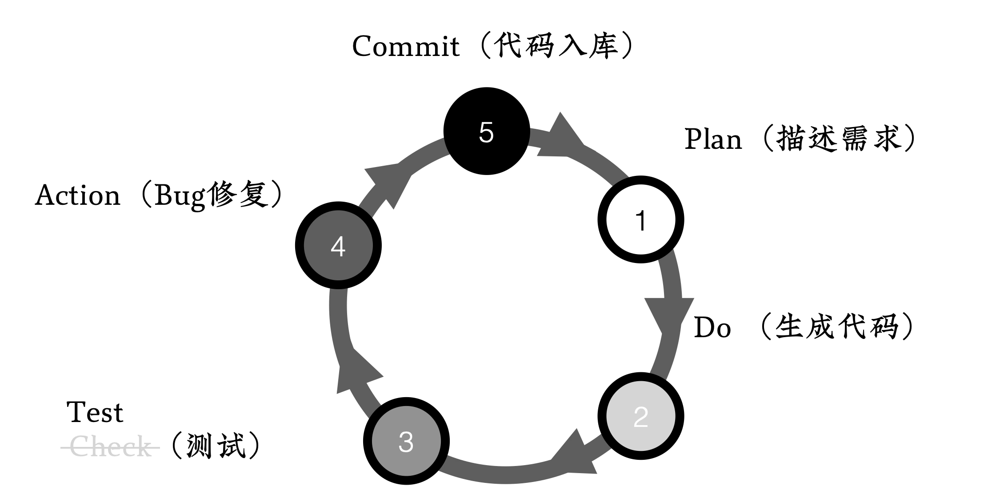
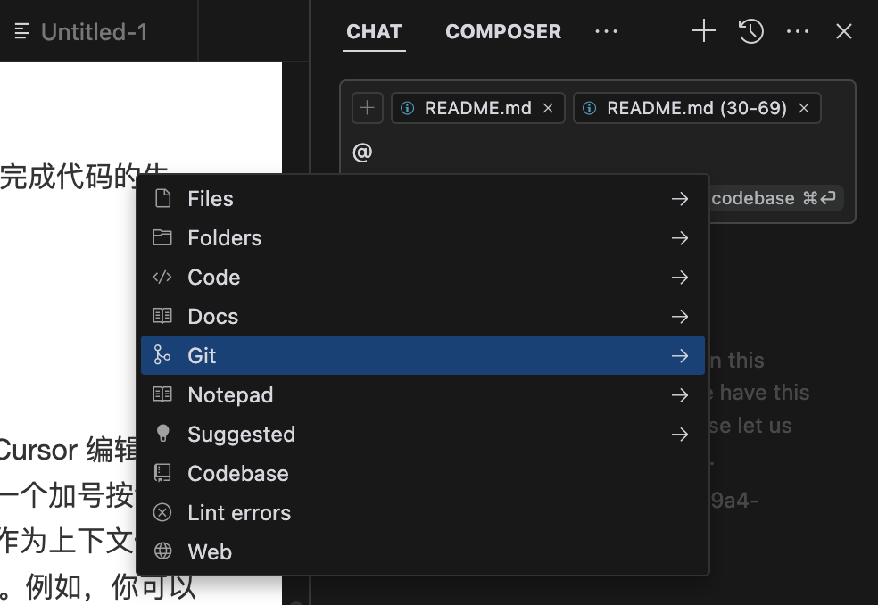
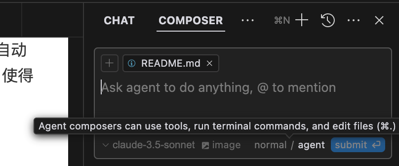
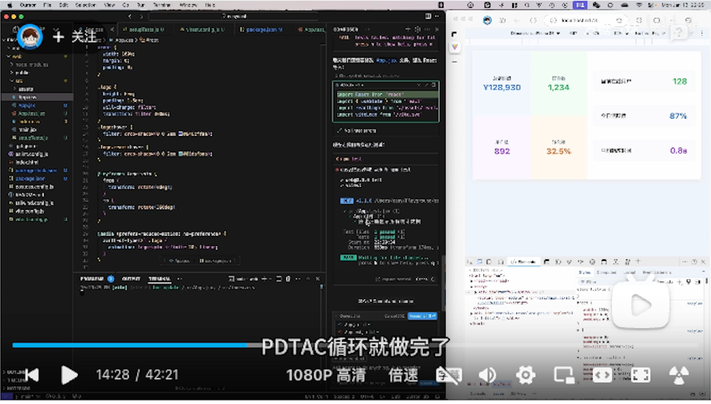

# PDTAC循环：最佳实践

## 一个可以融入日常的最佳实践

懂得一个道理很简单，难得是把它用起来；为了避免出现这种情况，我们针对PDCA循环进行了优化，提出了PDTAC循环。

广受欢迎的PDCA循环，包含四个步骤：计划(Plan)、执行(Do)、检查(Check)、行动(Action),这个经典的戴明环已经指导了无数项目走向成功。

## PDTAC

那么PDTAC有什么不同呢？

它保留了PDCA的精髓,但做了两个关键的升级:

1. 首先，将「Check」升级为「Test」,这不是简单的文字游戏,而是赋予了全新的内涵——强调自动化测试和全量测试的重要性
2. 其次，在最后增加了「Commit」环节,确保每一个进步都能及时保存，每一个改进都留下足迹。
3. 没有了

是的，就是如此简单。这是刻意的。因为我们发现对于流程来说，复杂了用的人就会少。

### Plan：描述需求

P代表的是Plan，对应到AI自编程中就是描述需求。

让人意外的是，清晰地描述需求，对于很多人来说，可能是一个困难的任务。也许，随着技术和交流方式的变化，现在很多人接触文字的机会变少了，更多的沟通方式转向了视频等形式。能够精准用语言表达需求的能力，反而正在变得越来越稀缺。

#### 具体而准确的描述需求

虽然语言能力不是短时间可以提升的，但我们依然有一些可以提升结果的技巧，比如「具体化」：

- 少说「不能用」，而是提供具体的错误信息；
- 少说「文档」，而是给出具体的扩展名甚至格式demo；
- 少说「数据」，而是指明具体使用的数据库类型和版本

幸运地是，因为AI生成代码的成本极低，所以即使你词不达意，天也不会掉下来，只是浪费了一些时间。通过观察AI的误解，可以知道我们在表达上的问题，从而反向提升我们的语文能力。呃，好像还能一举两得。

#### 使用专业术语和领域知识

另一方面，人类语言极为丰富，但在AI模型理解过程中，这种丰富性反而可能带来挑战。自然语言编程正是一个双刃剑。一方面，它让普通人无需学习编程知识就能与机器沟通；另一方面，由于自然语言的模糊性和宽泛性，模型可能容易产生误解。

为了解决这一问题，我们可以选择使用大模型能够准确理解的语言，从而提升需求描述的精准度。

使用专业术语和领域知识可以有效减少模糊性。例如，在计算机相关的技术领域，使用专业术语或在特定业务场景中的专有词汇，可以将模糊的描述转变为明确的指代，从而帮助模型更精准地理解你的意图。

#### 使用代码和伪代码

如果你会编写代码 —— 没人规定会写代码就必须写代码而不能用自然语言编程不是 —— 还可以将代码或伪代码作为需求描述的一部分。如果需求包含相对复杂的逻辑，用文字难以清晰表达时，伪代码是一个有效的工具。伪代码的格式灵活，你可以通过定义变量、使用循环和条件语句等方式，描述复杂的逻辑。语法错误、中文英文混杂都没有关系，只要能够清楚地传达逻辑结构，都能达到良好的效果。

#### 善用图片

当前很多AI编码工具已经可以支持图片描述（其实主要是模型支持了）。在很多情况下，尤其是和界面相关的业务中，「一图胜千言」并不夸张。记得好好利用这个功能。

### Do：生成代码

「Do」阶段对应的是代码生成。通常来说，点击一个按钮就能完成代码的生成。

然而，在 Cursor 编辑器中，还是有一些小技巧的。

#### 手动控制上下文

首先，在生成代码时，除了你输入的文本和当前打开的文件，Cursor 编辑器本身还提供了一个上下文选择功能。在输入框的上方，你会看到一个加号按钮，点击它之后，你可以选择与当前问题相关的文件，这些文件会被作为上下文使用。此外，在你输入`@`符号时，编辑器还会显示更多的上下文选项。例如，你可以选择一个目录、一个文件，或者选择特定的Git版本作为参考。如果你希望 Cursor 通过互联网进行搜索，你可以使用`@web`命令，它会自动开始在网络上进行搜索。

如果你有一些外部文档需要 Cursor 参考，也可以直接粘贴链接，编辑器会自动抓取文档内容并作为上下文提供给你。这些功能大大提高了工作的便利性，使得 Cursor 能够更加智能地理解和响应你的需求。

#### 代码生成工具

在代码生成方面，目前 Cursor 提供了两种工具：一种是 Chat，另一种是 Composer。

在Chat中，我们可以逐步提出问题，Cursor 会根据你的每个问题逐一生成代码，并将新代码显示在聊天回答中。生成后的代码会有一个「Apply」按钮，点击该按钮后，Cursor 会将新的代码与当前打开的文件进行对比，并将需要修改的部分自动应用进去。

如果你的任务只是修改少量内容，这种方式非常简单高效。然而，当任务变得更复杂，比如需要创建多个文件、执行多个命令或同时修改多个文件时，Chat工具就显得有些繁琐。因为你需要进行一系列手动操作，效率会受到一定的影响。

为了更高效地处理复杂任务，Cursor 还提供了 Composer 工具。在这个工具里边，Cursor会执行多步操作。我们可以选择「Agent」模式。

在这个模式下，当我们将编程任务发送给 Cursor 时，智能体会自动执行任务，并监测结果，用于判断是否需要进一步操作。如果任务没有完全完成，智能体会继续执行后续操作，直到完成为止。

举个例子，如果你要求 Cursor 创建一个目录并执行某些命令，它会先自动输出创建目录的命令，等待你的确认。确认后，它会继续执行后续操作。对于创建文件和修改文件等任务，智能体无需确认，操作会完全自动化完成。这种方式非常方便，它可以帮助你完成绝大部分工作，而你只需关注结果的输出。

在执行过程中，如果智能体转向了我们不希望的方向，可以直接在输入框中提出修改要求。Cursor 会根据指示实时进行调整，确保最终结果符合预期。

### Test：测试

关于测试，我们在前边已经用专门的章节进行过讨论，只需牢记「全量」和「自动化」两个关键词就好，这里就不赘述了。

### Action：Bug修复

再下来是「Action」阶段，对应到Bug修复。

#### 一般Bug的修复

通常来说，如果我们使用 Cursor 的Composer工具，在生成和修改代码后，它会自动检查静态语法分析的错误。一旦发现Bug，Cursor 会自动尝试修复，这是非常便捷的功能，因此我们推荐大家尽可能使用它。

#### 顽固Bug的修复

不过，在实际使用过程中，我们也可能会遇到一些顽固的Bug。遇到这些问题时，就需要我们手动介入处理了。

##### 如何识别顽固Bug

首先，我们需要识别 Cursor 是否已经陷入了无法解决的问题。

在我们提出需求后，我们仍然需要观察 Cursor 在执行过程中做了什么。可以不需要过于关注细节，但至少要了解它的整体方向。

如果我们发现 Cursor 提出的解决方案开始重复，例如它先提出了解决方案A，发现A无效后再改为B，B依然无效后又回到A，这时它就陷入了一个死循环。此时，我们就需要手动干预，避免它继续在这个循环中浪费时间。

首先要**终止这个循环**，并尝试为 Cursor **提供更多的上下文信息**，帮助它理解问题。检查一下是否有资料没有提供，或者是否遗漏了关键的代码库部分，尤其是那些与我们要解决问题直接相关的内容。

另外，要注意，**不要将新的问题加在原有问题的后边进行追加讨论**。这样做可能导致上下文过长，或者会违反「每次只做一件事」的原则。

更好的做法是，开启一个新的聊天（Chat）或编排（Composer）窗口，将新的问题单独提出来，然后观察新的结果。

另一个解决方案是**更换模型**。目前 Cursor 使用的模型是Cloud 3.5 sonnet，虽然它较为智能，但对于一些复杂任务，我们也可以尝试使用O1模型。

O1模型通过多次思考来提升其智能，尤其在面对复杂任务时，可能会提供不一样的解决方案。而且，两个模型有不同的思维维度，换个角度思考，可能就能找到问题的突破口。

如果上述方法仍然无法解决问题，我们可以借助外部帮助。你可以将问题提取出来，送到其他大模型中进行询问，或者根据情况进行人工干预，手动修正问题。

总体而言，遇到此类问题的情况相对较少。在我几个月的AI自编程经历中，这样的情况也只遇到过几次。通常这种问题会出现在文档不完整，或者文档版本混乱的情况下。有时候，项目文档混乱到即便是人类也难以理清，更别提 Cursor 了。然而，在真实世界的编程中，这种项目可不少。

### Commit：代码入库

将Commit作为循环的一大阶段只有一个原因 —— 防止忘了它。

请记住作为一个专业程序员的常识（雾）：

## 实践教程

> 纸上得来终觉浅，绝知此事要视频。

为了进一步说明PDTAC循环在实际项目中的使用，我们录制了一个视频教程。欢迎观看，记得订阅点赞哈。

- [Bilibili](https://www.bilibili.com/video/BV1accBeDEbU/)
- [Youtube](https://youtu.be/vQYVKABaQfw)